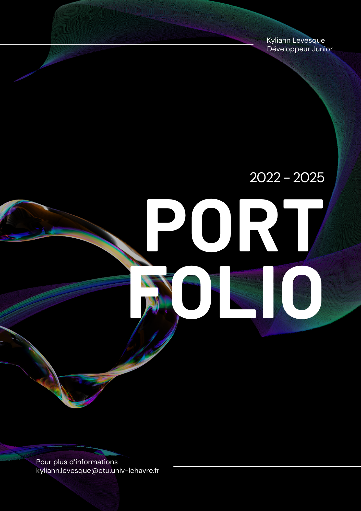

# Portfolio

## Description

Ce dépôt contient le code de mon Portfolio où je me présente ainsi que mes projets, compétences et expériences en tant qu'étudiant en développement. Le site web est réalisé en HTML, CSS et JavaScript, conçu pour être responsive et accessible sur tous les appareils.

## Navigation

Le site dispose d'une barre de navigation simple en haut, qui permet aux utilisateurs de se déplacer vers différentes sections du portfolio.

## Formulaire de contact

Le site dispose d'un formulaire de contact relié à Firebase, qui permet aux utilisateurs de laisser un message avec leur adresse mail afin que je puisse en prendre connaissance. Aucune donnée n'est utilisée à une quelconque fin.
Sur ce formulaire est également présent mon adresse mail universitaire pour me contacter directement.

### [Live demo](https://iklsi.github.io/Portfolio/)

## Auteur

Kyliann LEVESQUE - [LinkedIn](https://www.linkedin.com/in/kyliann-levesque-87711a277/) - [GitHub](https://github.com/IKLSI)